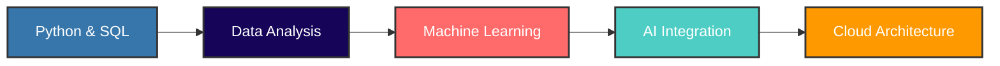

<p align="center">
  
</p>

---

## 🎯 Quick Glance

<div align="center">
  <table>
    <tr>
      <td align="center">
        
        <br/>
        <b>📍 Location</b><br/>India
      </td>
      <td align="center">
        
        <br/>
        <b>📧 Email</b><br/>sparshagg5645@gmail.com
      </td>
      <td align="center">
        
        <br/>
        <b>💼 Role</b><br/>Data Analyst
      </td>
    </tr>
  </table>
</div>

---

## 🚀 What I Do

```python
class SparshAgarwal:
    def __init__(self):
        self.role = "Data Analyst"
        self.focus = "AI-Powered Business Solutions"
        self.mission = "Transform data into decisions"
    
    def daily_work(self):
        return [
            "📊 Build dashboards & analytics solutions",
            "🤖 Integrate AI into business workflows", 
            "📉 Perform data analysis & trend identification",
            "⚡ Automate reporting & insights generation"
        ]
```

---

## 🛠️ Tech Stack

### Languages & Core Skills

<p align="center">
  
  
  
  
  
</p>

### Data & Analytics

<p align="center">
  
  
  
  
</p>

### Frameworks & Tools

<p align="center">
  
  
  
  
</p>

### Cloud & Deployment

<p align="center">
  
  
  
</p>

---

## 🏆 Featured Projects

### 📊 AI MIS Report Summariser

> **Transform raw data into executive-ready reports in seconds**

<p align="center">
  
  
  
  
</p>

**Features:**
- 🔬 **Smart EDA** - Automated exploratory data analysis
- 📊 **Auto Dashboard** - Instant visualization generation  
- 🤖 **AI Summary** - GPT-4 / Claude / Gemini powered insights
- 💬 **Chat with Data** - Natural language Q&A on your datasets
- 📄 **PDF Export** - One-click report generation

**Impact:** Reduces manual MIS reporting time by **90%**

<p align="center">
  <a href="#">
    
  </a>
  <a href="#">
    
  </a>
</p>

---

### 📈 Business Intelligence Dashboard

> **Real-time analytics for data-driven decision making**

<p align="center">
  
  
  
</p>

**Highlights:**
- 📊 Interactive KPI tracking
- 🔄 Real-time data synchronization
- 📱 Mobile-responsive design
- 🎯 Executive summary views

---

## 📊 GitHub Stats

<div align="center">

[](https://github.com/sparsh2413)

[](https://github.com/sparsh2413)

[](https://git.io/streak-stats)

</div>

---

## 🎓 Learning Journey



**Currently Mastering:**
- 📚 Advanced AWS Services (S3, Lambda, Redshift)
- 🤖 Deep Learning with PyTorch
- 📊 Real-time Streaming with Kafka
- 🏗️ Scalable Data Pipeline Architecture

---

## 💡 Philosophy

<div align="center">
  
</div>

> *"Data is not just numbers — it's a decision-making weapon."*

I don't just analyze data — I build systems that **think, explain, and guide decisions**.

---

## 🤝 Let's Connect

<div align="center">
  <p>
    <a href="https://www.linkedin.com/in/agarwalsparsh5645" target="_blank">
      
    </a>
    <a href="https://instagram.com/__sparshhh_" target="_blank">
      
    </a>
    <a href="mailto:sparshagg5645@gmail.com" target="_blank">
      
    </a>
    <a href="https://twitter.com/sparsh2413" target="_blank">
      
    </a>
  </p>
  
  <p>
    <a href="https://wa.me/91XXXXXXXXXX" target="_blank">
      
    </a>
    <a href="https://portfolio.sparshagg.vercel.app" target="_blank">
      
    </a>
  </p>
</div>

---

## 📬 Open For

<div align="center">

| 💼 Opportunities | 🎯 Collaborations | 🎤 Speaking |
|-----------------|-------------------|-------------|
| Data Analyst Roles | AI/ML Projects | Tech Talks |
| Remote Positions | Open Source | Workshops |
| Freelance Projects | Research | Mentoring |

</div>

---

## ☕ Support My Work

If you find my work helpful, consider buying me a coffee!

<div align="center">
  <a href="https://buymeacoffee.com/sparshagg">
    
  </a>
</div>

---

## 📈 Profile Views

<div align="center">
  
</div>

---

<p align="center">
  
</p>

---

<div align="center">
  <i>Made with ❤️ and ☕ by Sparsh Agarwal</i><br/>
  <i>Last Updated: May 2026</i>
</div>
